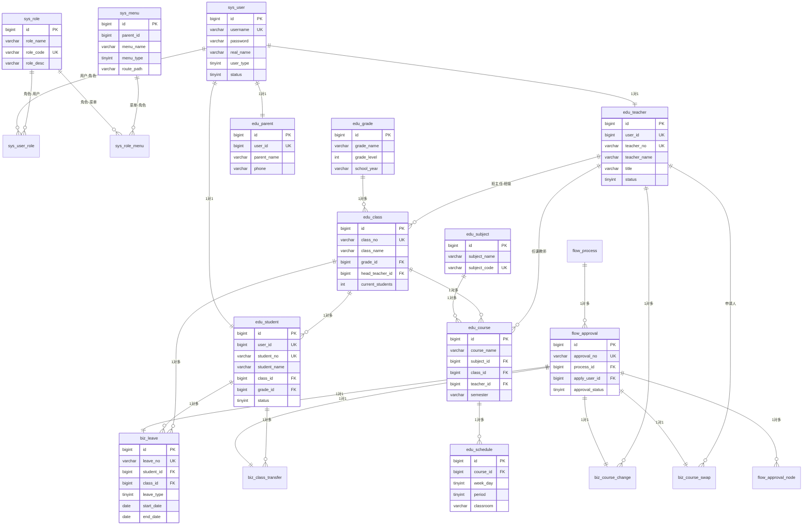

# 小学教务管理系统 - ER关系图

## 主要实体关系图（Mermaid格式）

---

## 详细模块关系图

### 1. 用户权限模块

### 2. 教务管理模块

### 3. 审批流程模块

---

## 核心业务流程图

### 学生请假流程

### 教师调课流程

### 学生调班流程

---

## 数据流向图

---

## 表分类与数量统计

---

## 如何查看ER图

### 方法一：在线Mermaid编辑器
1. 访问 https://mermaid.live/
2. 复制上述代码块中的 mermaid 代码
3. 粘贴到编辑器中即可查看

### 方法二：VS Code插件
1. 安装 "Markdown Preview Mermaid Support" 插件
2. 在 VS Code 中打开本文件
3. 按 `Ctrl+Shift+V` 预览

### 方法三：使用数据库建模工具
1. **Navicat**：导入数据库后，使用"逆向工程"功能自动生成ER图
2. **PowerDesigner**：导入SQL脚本生成物理数据模型
3. **DBeaver**：自带ER图功能，可视化展示表关系

---

## 表关系说明

### 一对一关系 (1:1)
- `sys_user` ←→ `edu_teacher` （用户与教师）
- `sys_user` ←→ `edu_student` （用户与学生）
- `sys_user` ←→ `edu_parent` （用户与家长）
- `flow_approval` ←→ `biz_leave` （审批与请假）

### 一对多关系 (1:N)
- `edu_grade` → `edu_class` （年级包含多个班级）
- `edu_class` → `edu_student` （班级包含多个学生）
- `edu_teacher` → `edu_class` （教师担任多个班级班主任）
- `edu_teacher` → `edu_course` （教师教授多门课程）
- `edu_course` → `edu_schedule` （课程对应多个时间段）

### 多对多关系 (M:N)
- `sys_user` ←→ `sys_role` （通过 sys_user_role）
- `sys_role` ←→ `sys_menu` （通过 sys_role_menu）
- `edu_student` ←→ `edu_parent` （通过 edu_student_parent）

---

**提示**：建议使用专业的数据库建模工具查看更详细的ER图，本文档提供的是简化版本。
